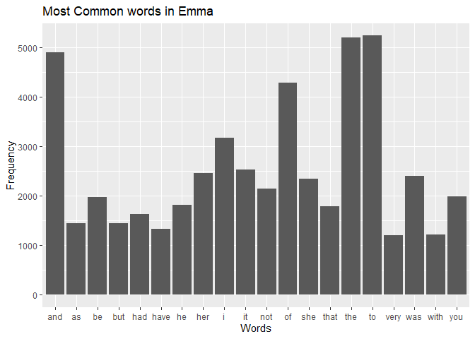

Assignment B3
================

``` r
#install if only necessary 
#install.packages("janeaustenr")
#install.packages(tidytext)
#install.packages("tm")
```

``` r
library(dplyr)# import for dplyr data manipulation. 
```

    ## 
    ## Attaching package: 'dplyr'

    ## The following objects are masked from 'package:stats':
    ## 
    ##     filter, lag

    ## The following objects are masked from 'package:base':
    ## 
    ##     intersect, setdiff, setequal, union

``` r
library(tidytext)# import to clean the text 
```

    ## Warning: package 'tidytext' was built under R version 4.4.2

``` r
library(janeaustenr)#use for the textbook
```

    ## Warning: package 'janeaustenr' was built under R version 4.4.2

``` r
library(tm)#textmining package for stop words removal 
```

    ## Warning: package 'tm' was built under R version 4.4.2

    ## Loading required package: NLP

    ## Warning: package 'NLP' was built under R version 4.4.2

``` r
library(ggplot2) #for plotting the function
```

    ## Warning: package 'ggplot2' was built under R version 4.4.2

    ## 
    ## Attaching package: 'ggplot2'

    ## The following object is masked from 'package:NLP':
    ## 
    ##     annotate

``` r
library(testthat)#used to test the function 
```

    ## 
    ## Attaching package: 'testthat'

    ## The following object is masked from 'package:dplyr':
    ## 
    ##     matches

``` r
#Exercise1 
#reference for stopwords removal: 
#https://medium.com/@esegui/stop-word-removal-in-r-9f46c4eef710
#reference on tokenizer package: https://cran.r-project.org/web/packages/tidytext/vignettes/tidytext.html


corpuso<-Corpus(VectorSource(janeaustenr::emma))
custom_stopwords <- c("is", "a", "for", "in")
corpuso_cleaned<-tm_map(corpuso,removeWords,custom_stopwords)
```

    ## Warning in tm_map.SimpleCorpus(corpuso, removeWords, custom_stopwords):
    ## transformation drops documents

``` r
text_cleaned <- as.character(corpuso_cleaned)

bookdata<-data.frame(text=text_cleaned[1])

words<-bookdata%>%
    unnest_tokens(word,text)
#try replacing the unnest function 
word_counts <- words %>%
    count(word, sort = TRUE)
#pick the top 20 most frequently used words  
top20<-word_counts%>%
    slice_max(n,n=20)
top20%>%
    ggplot(aes(x=word,y=n))+
    geom_col()+
    labs(title="Most Common words in Emma",x="Words",y="Frequency")
```

<!-- -->

**The rule of the word arrangement**

If words begin with a vowl (aeiou), move the inital vowl letter to the
end and then add et near the end of the word

If the words begin with Ch or Cr, then move both letters to the end of
the word and add et in the end

If the words begin with a consonant and the consonant is not Ch or Cr,
move the last letter from the end to the begining and then add et near
the end of the word.

``` r
rearrange_f <- function(word) {
     #check if it is a character 
  if (!is.character(word)){
    stop("Input is not a chracter, double check")
  }
    # Convert the word to lowercase for consistency
  word <- tolower(word)
    # Check if the word starts with a vowel
 if (grepl("^[aeiou]", word)) {
    # Rule 1: Starts with a vowel,move the first letter to the end and add et in the end  
    rearranged <- paste0(substr(word, 2, nchar(word)), substr(word, 1, 1), "et")}
        
    else if (grepl("^(ch)|(cr)",word)){
        #Rule 2: if start  with ch or cr, move both letters to the end of the word and add et in the end 
            rearranged <- paste0(substr(word, 3, nchar(word)), substr(word, 1, 2), "et")}
  else{ 
    #rule3: move the last letter to the first if starts with a consonant not "ch or "cr"
        rearranged <- paste0(substr(word, nchar(word), nchar(word)),substr(word, 1, nchar(word)-1), "et")}
    
  
return(rearranged)  }
```

``` r
#' Title: Rearrange the word function
#'Function description: This function is to rearrange the characters provided in the word. Rule1:  If words begin with a vowl (aeiou), move the inital vowl letter to the end and then add et near the end of the word.Rule2:If the words begin with Ch or Cr, then move both letters to the end of the word and add et in the end. Rule3:  If the words begin with a consonant and the consonant is not Ch or Cr, move the last letter from the end to the begining and then add et near the end of the word.Lastly, the function will return an error message if the non-character is provided 

#' @param word: a character provided for word rearrangement 

#' @return A character that has been rearranged based on the rules  
#' @examples
#' rearrange_f("word")

#' rearrange_f("apple")
```

Check the function output with examples.

``` r
rearrange_f("word")
```

    ## [1] "dworet"

``` r
rearrange_f("apple")
```

    ## [1] "ppleaet"

``` r
rearrange_f("banana")
```

    ## [1] "abananet"

``` r
rearrange_f("crab")
```

    ## [1] "abcret"

``` r
rearrange_f(1)
```

    ## Error in rearrange_f(1): Input is not a chracter, double check

``` r
#Test to see if character is the output 
test_that("A character is returned", 
          {expect_equal(class(rearrange_f("word")),"character")
          expect_equal(class(rearrange_f("apple")),"character")
          
  })
```

    ## Test passed 😀

``` r
#test to see if running error if giving noncharacter input  
test_that("run into error ",
 {expect_error(rearrange_f(TRUE))
  expect_error(rearrange_f(1))
})
```

    ## Test passed 😸

``` r
#Test if an expected value is generated 
#I first rearrnaged manually create two variables to indicate the output 
output1<-"dworet"
ouput2<-"ppleaet"

test_that ("generate the same out put",{
                    expect_equal(rearrange_f("word"),"dworet")
          expect_equal(rearrange_f("apple"),"ppleaet")
  })
```

    ## Test passed 😀
